# APIs e Web Services

_O planejamento de uma aplicação de APIS Web é uma etapa fundamental para o sucesso do projeto. Ao planejar adequadamente, você pode evitar muitos problemas e garantir que a sua API seja segura, escalável e eficiente._

### Descrição do Projeto:

O projeto tem como finalidade desenvolver uma plataforma para gerenciar aluguéis de mídias físicas e consoles em uma locadora de jogos retrô. Buscando tornar acessível esta coletânea ao público-alvo, o processo de aluguel tende a ser realizado de forma objetiva e eficiente. A aplicação, utilizando APIs e Web Services, permitirá que a plataforma possua um gerenciamento do estoque de jogos e consoles; a realização de reservas, devoluções e cancelamentos; o cadastro, edição e exclusão de clientes; e integração com soluções de pagamento.

 

## Objetivos da API

O objetivo é criar uma ferramenta prática, segura e moderna, que facilite a gestão do negócio e proporcione um atendimento de qualidade aos apaixonados por jogos clássicos. A aplicação deve ser intuitiva tanto para os administradores quanto para os clientes. 

- **Usuários**
  - Administrador: Permitir gerenciamento das contas de usuários.
  - Cliente: Permitir criar e gerenciar a própria conta.
  
- **Catálogo**
  - Administrador: Permitir adição, remoção e gerenciamento do controle de estoque dos jogos e consoles ofertados.
  - Cliente: Permitir visualização dos jogos e consoles. Esses serão adicionados ao carrinho pelo frontend (localStorage).
    
- **Reserva**
  - Administrador: Pode visualizar e cancelar as reservas (não há hard delete, nesse caso apenas muda seus status). Motivo: evitar perca de dados importantes de pagamentos.
  - Cliente: Permitir a realização de reservas das unidades de interesse do catálogo e checkout.

 

## Modelagem da Aplicação
A modelagem do projeto foi planejada para gerenciar um sistema de reservas de jogos, com sete entidades principais:

**Usuários (User):** Armazena dados de autenticação e identificação dos usuários do sistema. A tabela "Usuário" contém informações como nome, email, CPF, senha e um campo de tipo de usuário (admin ou usuário comum), que permite diferentes permissões e comportamentos na aplicação.

> **Relacionamentos:** Cada usuário tem endereços associados, armazenados na tabela "Address". Os usuários também podem fazer reservas de jogos, armazenadas na tabela "Reserve".

**Papel (Role):** A tabela "Role" define os tipos de usuário no sistema, diferenciando administradores de usuários normais.

> **Relacionamentos:** Um papel pode ser atribuído a múltiplos usuários.

**Endereços (Address):** Armazena informações sobre o endereço de cada usuário, incluindo rua, número, bairro, cidade, estado e código postal.

> **Relacionamentos:** Cada endereço pertence a um único usuário.

**Consoles (Console):** A tabela "Console" armazena informações sobre os consoles de jogos disponíveis no sistema, incluindo nome.

> **Relacionamentos:** Um console pode ter vários jogos associados.

**Jogos (Game):** Armazena detalhes sobre os jogos disponíveis, incluindo nome, preço, descrição e o console ao qual pertence.

> **Relacionamentos:** Cada jogo está associado a um único console. Os jogos podem ser reservados pelos usuários na tabela "Reserve".

**Reservas (Reserve):** Representa uma reserva feita por um usuário para um jogo específico, contendo informações como a data da reserva, aprovação e retorno do jogo.

> **Relacionamentos:** Cada reserva é feita por um usuário e refere-se a um jogo. O status da reserva é controlado por meio da tabela "StatusReserve".

**Status da Reserva (StatusReserve):** Representa o status da reserva de um jogo, como "pendente", "aprovada", "devolvida", etc.

> **Relacionamentos:** Cada status pode ser associado a múltiplas reservas.

 

 

## Tecnologias Utilizadas
Para o desenvolvimento do sistema foram utilizadas as seguintes tecnologias:

- **Node.js:** Tecnologia utilizada para o desenvolvimendo do Back-End.
- **Express e Prisma:** Tecnologia utilizada para o uso de Frameworks.
- **PostgreSQL:** Tecnologia utilizada para a criação e armazenamento do Banco de Dados.

 

## API Endpoints

Para acessar a documentação dos endpoints, basta acessar https://pmv-si-2025-1-pe6-t1-g5-locadora-retro.onrender.com/docs. Lá estará todos os detalhes das rotas disponíveis.

**IMPORTANTE: A primeira request demora aproximadamente 50s. Isso acontece por causa do Render deixar em stand-by quando a api não está sendo utilizada. Após a primeira request e o tempo esperado ela se normaliza. O Render é gratuito e disponibiliza banco de dados, por isso a sua escolha.**

 

## Considerações de Segurança

Na aplicação para acessar as rotas é preciso estar autenticado. Usamos tokens JWT para confirmarmos se o usuário está autenticado. 

Na parte de autorização, os usuários possui uma relação com uma tabela de "role". Lá temos dois grandes grupos: administrador e usuário comum. Através de middlewares verificamos além da autenticação, o tipo de usuário para que certas ações no servidor sejam liberadas para o administrador e outras bloqueadas para usuários.

Quanto a proteção de ataques, nosso servidor possui algumas travas importantes como limite de requisições e timeouts para evitar ataques que comprometam a disponibilidade da aplicação.

Importante citar também que dados de senhas são encriptografados. Usamos hashes para salvar essas senhas no banco de dados e conferimos se o valor da senha bate com o hash para que os usuários se autentiquem. Tivemos o cuidado também de nunca retornar a senha criptografada pelas rotas, para evitar ataques de força bruta fora do servidor.

 

## Implantação

Para subir a aplicação em produção, foi necessário usar o Render. Ele nos permite um ambiente gratuito assim como um banco de dados. Nesse caso, para acessar a nossa api, basta acessar o site https://pmv-si-2025-1-pe6-t1-g5-locadora-retro.onrender.com.

**IMPORTANTE: A primeira request demora aproximadamente 50s. Isso acontece por causa do Render deixar em stand-by quando a api não está sendo utilizada. Após a primeira request e o tempo esperado ela se normaliza. O Render é gratuito e disponibiliza banco de dados, por isso a sua escolha.**

Usamos um ambiente de produção específico, com env de produção para acesso ao Sandbox do Asaas, nosso gateway de pagamentos, endpoint do banco de dados do Render e o nosso segredo do JWT. A aplicação foi subida com configurações do Dockerfile.prod.

 

## Testes
# 🧪 Casos de Teste da API

---

## 🔐 Autenticação de Usuários

### 🔸 `POST /auth/login`

#### ✅ Teste: Login com credenciais válidas
- **Entrada:** E-mail e senha corretos  
- **Resultado Esperado:** `200 OK`  
- **📎 Evidência:** [Visualizar Evidência](https://drive.google.com/file/d/1rFGFNwHURRtftgrmp4xwWxau1yH-IWHD/view?usp=drive_link)

#### ❌ Teste: Login com credenciais inválidas
- **Entrada:** E-mail ou senha incorretos  
- **Resultado Esperado:** `400 Bad Request` com mensagem de erro  
- **📠Evidência:** 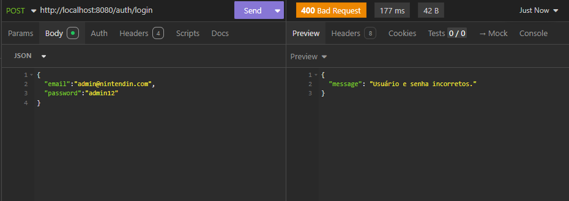

---

## 👥 Listagem de Usuários

### 🔸 `GET /users/`

#### ✅ Teste: Token válido
- **Entrada:** Token de autenticação  
- **Resultado Esperado:** `200 OK`  
- **📎 Evidência:** [Visualizar Evidência](https://drive.google.com/file/d/1ekORIumLeZOhekgbd40N5NghZofkwcQ-/view?usp=drive_link)

#### ❌ Teste: Token inválido ou expirado
- **Resultado Esperado:** `401 Unauthorized`  
- **📠Evidência:** 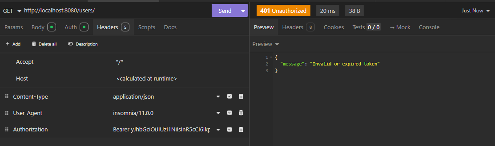

---

## 📝 Atualização de Usuário

### 🔸 `PUT /users/{id}`

#### ✅ Teste: Atualização com dados válidos
- **Entrada:** ID e novos dados  
- **Resultado Esperado:** `200 OK`  
- **📎 Evidência:** [Visualizar Evidência](https://drive.google.com/file/d/15WIYHCZuZXHIZ0yGbkxDlOpj8Our7djY/view?usp=drive_link)

#### ❌ Teste: Token inválido ou expirado
- **Resultado Esperado:** `401 Unauthorized`  
- **📠Evidência:** 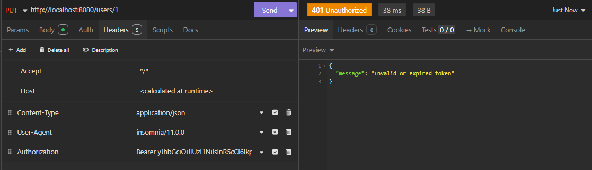

---

## ➕ Criação de Usuário

### 🔸 `POST /users/`

#### ✅ Teste: Dados válidos e token válido
- **Resultado Esperado:** `200 OK`  
- **📎 Evidência:** [Visualizar Evidência](https://drive.google.com/file/d/1hamxy_7VLlqksD53kni6BbgBF23n89Gl/view?usp=drive_link)

#### ❌ Teste: Token inválido ou expirado
- **Resultado Esperado:** `401 Unauthorized`  
- **📠Evidência:** 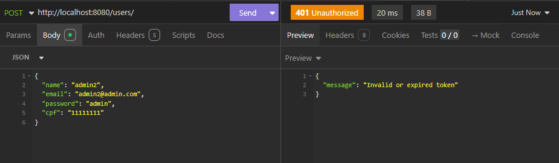

---

## 🗑️ Exclusão de Usuário

### 🔸 `DELETE /users/{id}`

#### ✅ Teste: Exclusão com token válido
- **Entrada:** ID do usuário  
- **Resultado Esperado:** `200 OK`  
- **📎 Evidência:** [Visualizar Evidência](https://drive.google.com/file/d/1oTk0ncebwvK7HAVCyNLPdL6WqmoxtX9s/view?usp=drive_link)

#### ❌ Teste: Token inválido ou expirado
- **Resultado Esperado:** `401 Unauthorized`  
- **📠Evidência:** 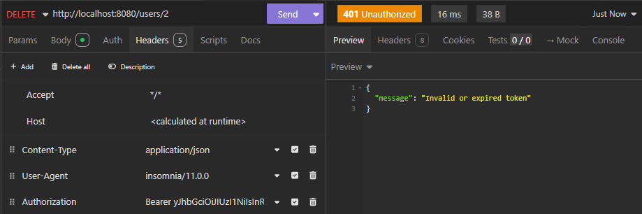

---

## 🎮 Criação de Console

### 🔸 `POST /consoles/`

#### ✅ Teste: Dados válidos e token válido
- **Resultado Esperado:** `200 OK`  
- **📎 Evidência:** [Visualizar Evidência](https://drive.google.com/file/d/1ZRnyNyXFdoxaNibJ2FTiNenYw_6HJJrK/view?usp=drive_link)

#### ❌ Teste: Token inválido ou expirado
- **Resultado Esperado:** `401 Unauthorized`  
- **📠Evidência:** 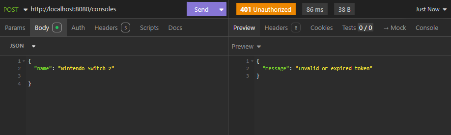

---

## 📋 Listagem de Consoles

### 🔸 `GET /consoles/`

#### ✅ Teste: Token válido
- **Resultado Esperado:** `200 OK`  
- **📎 Evidência:** [Visualizar Evidência](https://drive.google.com/file/d/11AbY15RrgWJkptU6h0r4ZWjenLhJGC40/view?usp=drive_link)

#### ❌ Teste: Token inválido ou expirado
- **Resultado Esperado:** `401 Unauthorized`  
- **📠Evidência:** 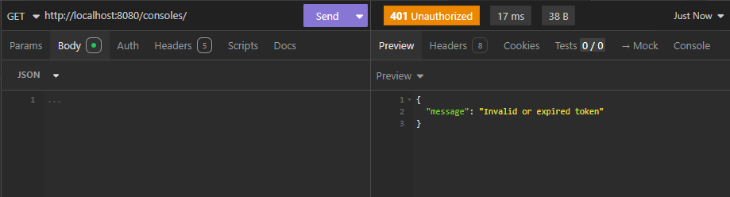

---

## ✏️ Atualização de Console

### 🔸 `PUT /consoles/{id}`

#### ✅ Teste: Dados válidos e token válido
- **Resultado Esperado:** `200 OK`  
- **📎 Evidência:** [Visualizar Evidência](https://drive.google.com/file/d/1qJZH_ZaNxMBQpjABGW2YQziIk7Qsddoq/view?usp=drive_link)

#### ❌ Teste: Token inválido ou expirado
- **Resultado Esperado:** `401 Unauthorized`  
- **📠Evidência:** 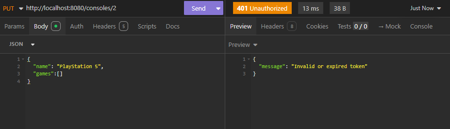

---

## 🗑️ Exclusão de Console

### 🔸 `DELETE /consoles/{id}`

#### ✅ Teste: Exclusão com token válido
- **Resultado Esperado:** `200 OK`  
- **📎 Evidência:** [Visualizar Evidência](https://drive.google.com/file/d/1svaVqQLGGerG-WKfjio8wn9Y_AgC2jJ-/view?usp=drive_link)

#### ❌ Teste: Token inválido ou expirado
- **Resultado Esperado:** `401 Unauthorized`  
- **📠Evidência:** 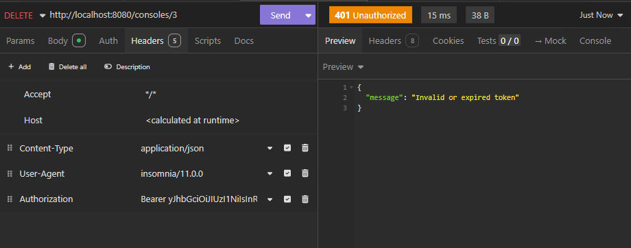

---

## 🕹️ Criação de Jogo

### 🔸 `POST /games/`

#### ✅ Teste: Dados válidos e token válido
- **Resultado Esperado:** `200 OK`  
- **📎 Evidência:** [Visualizar Evidência](https://drive.google.com/file/d/1lp2NYGDP42dfWJ_zclBTNM6jCQ3iQT6E/view?usp=drive_link)

#### ❌ Teste: Token inválido ou expirado
- **Resultado Esperado:** `401 Unauthorized`  
- **📠Evidência:** 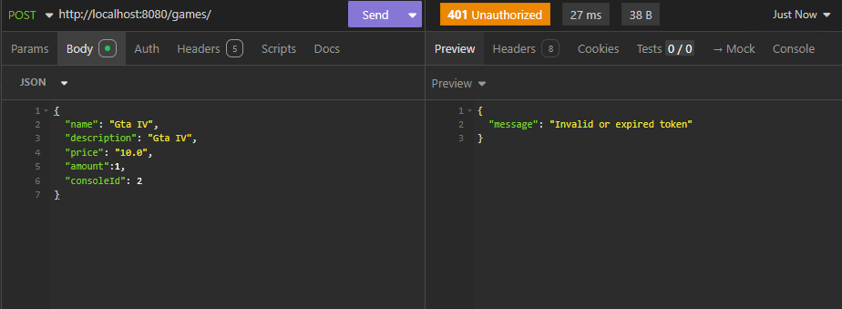

---

## 🎲 Listagem de Jogos

### 🔸 `GET /games/`

#### ✅ Teste: Token válido
- **Resultado Esperado:** `200 OK`  
- **📎 Evidência:** [Visualizar Evidência](https://drive.google.com/file/d/1MU9IGygTe2ZLaMbXZQLVyTUmq5eyqWqP/view?usp=drive_link)

#### ❌ Teste: Token inválido ou expirado
- **Resultado Esperado:** `401 Unauthorized`  
- **📠Evidência:** 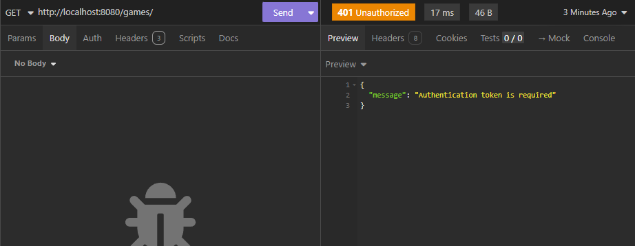

---

## 🔧 Edição de Jogo

### 🔸 `PUT /games/{id}`

#### ✅ Teste: Edição com dados válidos
- **Resultado Esperado:** `200 OK`  
- **📎 Evidência:** [Visualizar Evidência](https://drive.google.com/file/d/15IzCWhkOQaqgLiNl2ixYwZVxxKL-Kzhf/view?usp=drive_link)

#### ❌ Teste: Token inválido ou expirado
- **Resultado Esperado:** `401 Unauthorized`  
- **📠Evidência:** 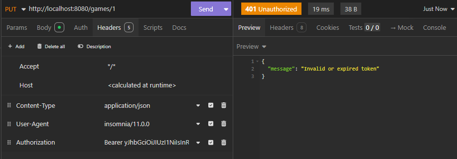

---

## ❌ Exclusão de Jogo

### 🔸 `DELETE /games/{id}`

#### ✅ Teste: Exclusão com token válido
- **Resultado Esperado:** `200 OK`  
- **📎 Evidência:** [Visualizar Evidência](https://drive.google.com/file/d/1A7Qe_WKpwb3fosMva5cfRHHxUXcrJav1/view?usp=drive_link)

#### ❌ Teste: Token inválido ou expirado
- **Resultado Esperado:** `401 Unauthorized`  
- **📠Evidência:** 

---

## 🧾 Criação de Pedido

### 🔸 `POST /orders/`

#### ✅ Teste: Criação com token válido
- **Resultado Esperado:** `200 OK`  
- **📎 Evidência:** [Visualizar Evidência](https://drive.google.com/file/d/1V8LJKWUtX7watxK9xks5WtS7vc2G1_ek/view?usp=drive_link)

#### ❌ Teste: Token inválido ou expirado
- **Resultado Esperado:** `401 Unauthorized`  
- **📠Evidência:** 

---

## 📦 Listagem de Pedidos

### 🔸 `GET /orders/`

#### ✅ Teste: Token válido
- **Resultado Esperado:** `200 OK`  
- **📎 Evidência:** [Visualizar Evidência](https://drive.google.com/file/d/11zrxsWs9YMWqizHejbYcK-4u479QJMa-/view?usp=drive_link)

#### ❌ Teste: Token inválido ou expirado
- **Resultado Esperado:** `401 Unauthorized`  
- **📠Evidência:** 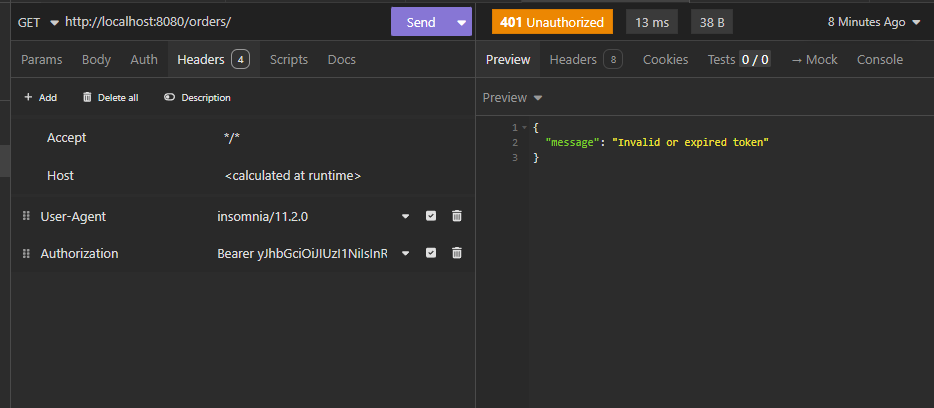

---

## 🗑️ Exclusão de Pedido

### 🔸 `DELETE /orders/{id}`

#### ✅ Teste: Exclusão com token válido
- **Resultado Esperado:** `200 OK`  
- **📎 Evidência:** [Visualizar Evidência](https://drive.google.com/file/d/1UM3WCViQW_qUGpe_ejQ5eqqlcvjRI3pR/view?usp=drive_link)

#### ❌ Teste: Token inválido ou expirado
- **Resultado Esperado:** `401 Unauthorized`  
- **📠Evidência:** 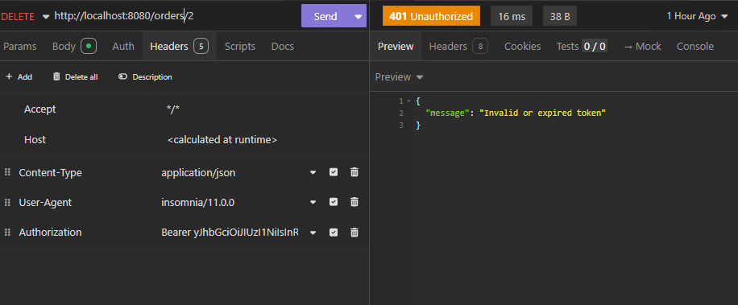

Os testes foram de uso, estão evidenciados no Google Drive. Basta acessar e assistir os vídeos para conferir como nossa aplicação funciona caso todos os parâmetros das rotas estejam configurados corretamente.

https://drive.google.com/drive/folders/1isUfbe3y5m5w7ze5F4Zm1rtoaPpqOdLy?usp=sharing

 

# Referências

A maioria das referências foram diretamente das documentações oficiais dos recursos que utilizamos. Alguns membros da equipe já possuíam certos conhecimentos que foram repassados durantes as reuniões internas.

- https://github.com/kelektiv/node.bcrypt.js

- https://github.com/auth0/node-jsonwebtoken

- https://docs.asaas.com/

- http://expressjs.com/

- https://docs.docker.com/

- https://nodejs.org/docs/latest/api/

- https://davibaltar.medium.com/documenta%C3%A7%C3%A3o-autom%C3%A1tica-de-apis-em-node-js-com-swagger-parte-2-usando-openapi-v3-cbc371d8c5ee
