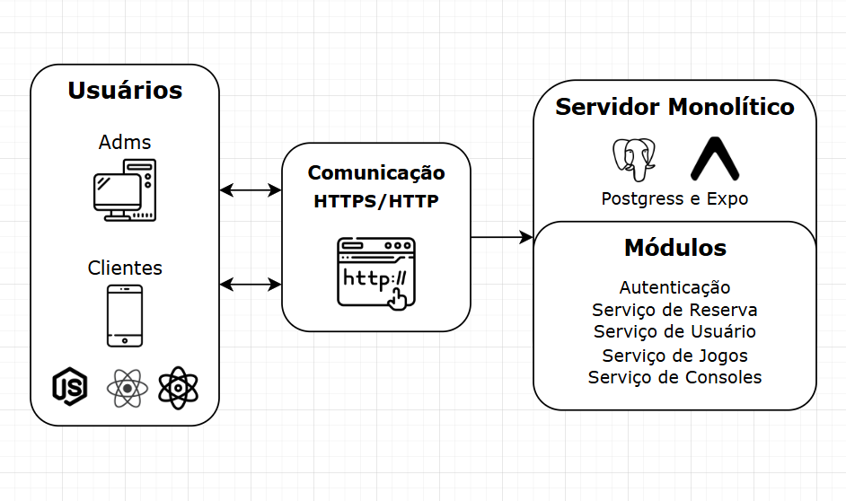

# Introdução

Nos últimos anos, o mercado de jogos retrô tem crescido significativamente, impulsionado tanto pela nostalgia dos jogadores veteranos quanto pelo interesse de novas gerações em experimentar clássicos que marcaram época. No entanto, a disponibilidade desses jogos ainda é um desafio, pois muitas locadoras físicas foram descontinuadas e as opções digitais nem sempre oferecem uma experiência completa.
Diante desse cenário, este projeto tem como objetivo desenvolver uma aplicação híbrida (mobile e web) para a locação de jogos retrô, proporcionando aos usuários um acesso prático e organizado a um catálogo diversificado. A plataforma permitirá que os clientes explorem títulos, realizem reservas e acompanhem suas locações de forma intuitiva e eficiente.

 

## Problematica

Nos dias de hoje é possível encontrar jogos retro digitalmente para se jogar em emuladores, mas muitas pessoas tem o desejo de jogar esses jogos em seus consoles de origem de forma física. A escassez de e dificuldade de acesso a jogos retrô em formato físico limitam a experiência de muitos entusiastas de videogames clássicos. Jogos e consoles de décadas passadas nos dias de hoje se encontram em uma escassez devido a sua falta de produção, o que gera uma de supervalorização de custo. Isso faz com que seu valor de compra fique em valores orbitantes dificultando o a possibilidade de aquisição.
O problema central que buscamos solucionar é a facilitação de acesso ao público dessas mídias físicas dos jogos e dos consoles, fazendo com que todas as pessoas possam desfrutar essa experiência.

 

## Objetivos

### 3.1 Objetivo Geral

- Desenvolver uma aplicação web e mobile que facilite a locação de jogos retrô, proporcionando uma interface intuitiva para a busca, reserva e administração dos jogos disponíveis.

### 3.2 Objetivos Específicos

- Criar um sistema de cadastro de usuários e locações, garantindo segurança e praticidade no processo de aluguel.

- Implementar um catálogo interativo com informações detalhadas sobre os jogos disponíveis.

- Desenvolver funcionalidades para reserva e devolução de jogos, otimizando a gestão do acervo.

- Criar notificações e lembretes para usuários sobre prazos de locação.

- Garantir a compatibilidade da aplicação em diferentes dispositivos, proporcionando uma experiência fluida tanto em web quanto mobile.

 

## Justificativa

O mercado de jogos retrô tem ganhado cada vez mais relevância, seja pelo crescimento da comunidade de colecionadores, pelo aumento da nostalgia entre jogadores veteranos ou pela curiosidade das novas gerações. No entanto, a disponibilidade desses jogos é limitada nos dias atuais, especialmente no formato físico. Muitas locadoras tradicionais deixaram de existir, e o acesso a jogos antigos tornou-se restrito a coleções particulares ou a compras de títulos muitas vezes inflacionados.

Diante desse contexto, a criação de uma plataforma digital para locação de jogos retrô se justifica pela necessidade de modernizar o acesso a esse acervo, tornando a experiência mais acessível, organizada e conveniente para os usuários. A aplicação permitirá que tanto entusiastas quanto novos jogadores tenham a oportunidade de explorar títulos clássicos sem a necessidade de um grande investimento inicial na compra de mídias físicas.

Além disso, o projeto se destaca por sua abordagem híbrida (mobile e web), garantindo flexibilidade e acessibilidade. A proposta também beneficia empreendedores e donos de acervos, que poderão administrar suas coleções de maneira mais eficiente, alcançando um público maior e facilitando o gerenciamento das locações.

 

## Público-Alvo
A **NintendIN** tem como público-alvo entusiastas por videogames clássicos, aqueles que vivenciaram a era dos consoles dos anos 80 e 90, e jogadores mais jovens, que têm curiosidade sobre os clássicos e desejam experimentar jogos que definiram as bases da indústria de entretenimento eletrônico. O apelo nostálgico e a possibilidade de explorar jogos que não estão mais amplamente disponíveis nas plataformas modernas tornam esse público fiel e engajado.

### Usuários
 - **Participantes da Comunidade Geek/Nerd:** Pessoas que têm interesse por cultura pop, jogos, filmes e séries retro, colecionadores de itens vintage e fãs de eventos de cultura geek.
 - **Jogadores Antigos:** Aqueles que, apesar de estarem atualizados com as tecnologias de jogos modernos, têm uma conexão emocional e nostálgica com os jogos retro.
 - **Novas Geração de jogadores:** Jovens que têm curiosidade sobre jogos antigos e querem conhecê-los sem grandes investimentos.
 - **Colecionadores:** Pessoas que colecionam jogos e consoles, que podem ser atraídas pela oportunidade de experimentar títulos que não possuem e encontram dificuldade em disponibilidade de compra.
 - **Nostalgia Familiar**: Muitos pais podem querer relembrar os jogos da sua juventude com seus filhos, como uma maneira de compartilhar essa parte de sua história e cultura.

### Mapa de Stakeholders
- **Usuários Diretos:** Jogadores da antiga geração, Comunidade Geek/Nerd, Colecionadores.
- **Usuários Indiretos:** Jogadores da nova geração de jogos virtuais
- **Influenciadores:** Integrantes de Famílias, Grupos e Comunidades

 

# Especificações do Projeto

## Requisitos
As tabelas que se seguem apresentam os requisitos funcionais e não funcionais que detalham o escopo do projeto. Para determinar a prioridade de requisitos, aplicar uma técnica de priorização de requisitos e detalhar como a técnica foi aplicada.

### Requisitos Funcionais

| ID      | Descrição do Requisito                                                                                      | Prioridade | Responsável  |
|---------|------------------------------------------------------------------------------------------------------------|------------|--------------|
| RF-001  | Permitir que o usuário realize seu cadastro, edite seus dados cadastrais e exclua sua conta.               | ALTA       | Sarah        |
| RF-002  | Permitir que o administrador cadastre, edite e exclua jogos do catálogo.                                   | ALTA       | Matheus      |
| RF-003  | Permitir que o usuário visualize a lista de jogos disponíveis e utilize filtros por categoria, console ou ano. | ALTA       | Julia        |
| RF-004  | Permitir que o usuário realize e cancele reservas de jogos disponíveis.                                    | ALTA       | Bianka       |
| RF-005  | A reserva deve ser feita com um sistema de pagamento de cartão de crédito.                | ALTA       | Bayerl    |
| RF-006  | Permitir que o administrador visualize todas as reservas realizadas.         | MÉDIA       | Bayer        |

  

### Requisitos Não Funcionais

| ID      | Descrição do Requisito Não Funcional                                                                 | Prioridade | Nome                                     |
|---------|------------------------------------------------------------------------------------------------------|------------|------------------------------------------|
| RNF-001 | A interface do sistema deve ser fácil de usar e adaptável para computadores e celulares.              | MÉDIA      | Matheus de Oliveira Souza Santos        |
| RNF-002 | O sistema deve ser compatível com os navegadores Chrome, Firefox e Edge.                              | MÉDIA      | Guilherme Campos Bayerl Coelho          |
| RNF-003 | O sistema deve utilizar autenticação segura com senha criptografada.                                  | ALTA       | Guilherme Monteiro Barbosa de Jesus     |
| RNF-004 | O sistema deve ser intuitivo e de fácil uso, proporcionando uma experiência fluida para todos os usuários, garantindo compatibilidade com leitores de tela e contrastes adequados. | MÉDIA      | Michael Henrique Ferreira Dias          |
| RNF-005 | O sistema deve possuir permissões diferentes para administrador e usuário comum.     | ALTA       | Bianka Dias Tenório D'Albuquerque       |

 

## Restrições

O projeto está restrito pelos itens apresentados na tabela a seguir.

|ID| Restrição                                                                                               |
|--|---------------------------------------------------------------------------------------------------------|
|01| O sistema deve ser entregue ao fim da etapa.                                                      |

 

# Catálogo de Serviços

|ID|	Serviço	Descrição                                                                                    |
|--|------------------------------------------------------------------------------------------------------|
|Catálogo de Jogos|	Permite aos clientes visualizar e pesquisar jogos disponíveis para compra.            |
|Carrinho de Compras|	Permite adicionar, remover e modificar itens antes da finalização da compra.        |
|Processamento de Pagamento|	Garante pagamentos seguros via cartão de crédito, boleto e PIX.              |
|Gestão de Pedidos|	Registra e acompanha pedidos, permitindo ao usuário visualizar o status da compra.    |
|Avaliação de Produtos|	Usuários cadastrados podem deixar avaliações e comentários nos jogos.             |
|Controle de Estoque|	Atualiza automaticamente a quantidade de produtos disponíveis após cada compra.     |
|Suporte ao Cliente|	Canal de atendimento para dúvidas, trocas e devoluções.                              |

 

# Arquitetura da Solução

A imagem abaixo representa como a solução será arquitetada, visando atender os requisitos de maneira otimizada, tanto tecnologicamente quanto do conhecimento e domínio da equipe no uso das mesmas.

  

# Tecnologias Utilizadas 

Essas são as tecnologias utilizadas para o desenvolvimento de nosso sistema de aluguel de jogos, **Nintendin**:  

| Atuação | Linguagem | Descrição |                                  
|---------|-----------|-----------|
| **Front-End**  | **`React`**     **`React Native + Expo`**    **`JavaScript`** | Para a aplicação web, garantindo uma experiência interativa e responsiva.    Para o desenvolvimento do aplicativo mobile.     Como linguagem principal para o frontend.| 
| **APIs**  | **`Axios`**    **`REST API`**| Biblioteca para realizar requisições HTTP de maneira simplificada, permitindo chamadas à API do backend.    O backend será estruturado para expor endpoints RESTful. | 
| **Back-End**  | **`Node.js + Express`**    **`PostgreSQL`** |  Para o desenvolvimento da API backend.    Utilizado como banco de dados relacional.|

| Atuação | Ferramenta de Desenvolvimento | Descrição |                                  
|---------|-----------|-----------|
| **IDE** | **`Visual Studio Code (VSCode)`** | Será a principal IDE utilizada no desenvolvimento, devido à sua versatilidade e ampla compatibilidade com extensões.  

 

## Hospedagem
| Atuação | Hospedagem | Descrição |                                  
|---------|-----------|-----------|
| **Front-End**  | **`Vercel`** | Suporte nativo para React.   Deploy fácil (basta conectar com Github).   Domínio gratuito (exemplo.vercel.app).   CI/CD integrado (atualiza ao dar push no repositório). |
| **Back-End** |**`Render`** | Hospeda APIs Node.js gratuitamente.   Banco de dados PostgreSQL grátis.   Embora desligue após períodos de inatividade, não é um problema tendo em vista o contexto da aplicação. |
| **Mobile** |**`Expo`** | Publicação no Expo Go para rodar em dispositivos físicos sem precisar de build nativo.   Expo EAS pode ser uma opção caso necessário, embora a hospedagem gratuita tenha limitações.| 
