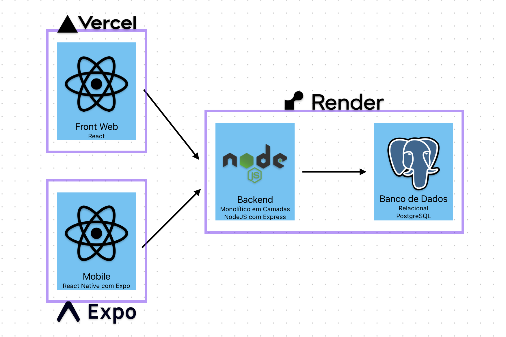

# Introdução

Texto descritivo com a visão geral do projeto abordado. Inclui o contexto, o problema, os objetivos, a justificativa e o público-alvo do projeto.

 

## Problema
Nesse momento você deve apresentar o problema que a sua aplicação deve  resolver. No entanto, não é a hora de comentar sobre a aplicação.

Descreva também o contexto em que essa aplicação será usada, se  houver: empresa, tecnologias, etc. Novamente, descreva apenas o que de  fato existir, pois ainda não é a hora de apresentar requisitos  detalhados ou projetos.

Nesse momento, o grupo pode optar por fazer uso  de ferramentas como Design Thinking, que permite um olhar de ponta a ponta para o problema.

> **Links Úteis**:
> - [Objetivos, Problema de pesquisa e Justificativa](https://medium.com/@versioparole/objetivos-problema-de-pesquisa-e-justificativa-c98c8233b9c3)
> - [Matriz Certezas, Suposições e Dúvidas](https://medium.com/educa%C3%A7%C3%A3o-fora-da-caixa/matriz-certezas-suposi%C3%A7%C3%B5es-e-d%C3%BAvidas-fa2263633655)
> - [Brainstorming](https://www.euax.com.br/2018/09/brainstorming/)

 

## Objetivos

Aqui você deve descrever os objetivos do trabalho indicando que o objetivo geral é desenvolver um software para solucionar o problema apresentado acima. 

Apresente também alguns (pelo menos 2) objetivos específicos dependendo de onde você vai querer concentrar a sua prática investigativa, ou como você vai aprofundar no seu trabalho.
 
> **Links Úteis**:
> - [Objetivo geral e objetivo específico: como fazer e quais verbos utilizar](https://blog.mettzer.com/diferenca-entre-objetivo-geral-e-objetivo-especifico/)

 

## Justificativa

O mercado de jogos retrô tem ganhado cada vez mais relevância, seja pelo crescimento da comunidade de colecionadores, pelo aumento da nostalgia entre jogadores veteranos ou pela curiosidade das novas gerações. No entanto, a disponibilidade desses jogos é limitada nos dias atuais, especialmente no formato físico. Muitas locadoras tradicionais deixaram de existir, e o acesso a jogos antigos tornou-se restrito a coleções particulares ou a compras de títulos muitas vezes inflacionados.

Diante desse contexto, a criação de uma plataforma digital para locação de jogos retrô se justifica pela necessidade de modernizar o acesso a esse acervo, tornando a experiência mais acessível, organizada e conveniente para os usuários. A aplicação permitirá que tanto entusiastas quanto novos jogadores tenham a oportunidade de explorar títulos clássicos sem a necessidade de um grande investimento inicial na compra de mídias físicas.

Além disso, o projeto se destaca por sua abordagem híbrida (mobile e web), garantindo flexibilidade e acessibilidade. A proposta também beneficia empreendedores e donos de acervos, que poderão administrar suas coleções de maneira mais eficiente, alcançando um público maior e facilitando o gerenciamento das locações.

 

## Público-Alvo
A **NintendIN** tem como público-alvo entusiastas por videogames clássicos, aqueles que vivenciaram a era dos consoles dos anos 80 e 90, e jogadores mais jovens, que têm curiosidade sobre os clássicos e desejam experimentar jogos que definiram as bases da indústria de entretenimento eletrônico. O apelo nostálgico e a possibilidade de explorar jogos que não estão mais amplamente disponíveis nas plataformas modernas tornam esse público fiel e engajado.

### Usuários
 - **Participantes da Comunidade Geek/Nerd:** Pessoas que têm interesse por cultura pop, jogos, filmes e séries retro, colecionadores de itens vintage e fãs de eventos de cultura geek.
 - **Jogadores Antigos:** Aqueles que, apesar de estarem atualizados com as tecnologias de jogos modernos, têm uma conexão emocional e nostálgica com os jogos retro.
 - **Novas Geração de jogadores:** Jovens que têm curiosidade sobre jogos antigos e querem conhecê-los sem grandes investimentos.
 - **Colecionadores:** Pessoas que colecionam jogos e consoles, que podem ser atraídas pela oportunidade de experimentar títulos que não possuem e encontram dificuldade em disponibilidade de compra.
 - **Nostalgia Familiar**: Muitos pais podem querer relembrar os jogos da sua juventude com seus filhos, como uma maneira de compartilhar essa parte de sua história e cultura.

### Mapa de Stakeholders
- **Usuários Diretos:** Jogadores da antiga geração, Comunidade Geek/Nerd, Colecionadores.
- **Usuários Indiretos:** Jogadores da nova geração de jogos virtuais
- **Influenciadores:** Integrantes de Famílias, Grupos e Comunidades

 

# Especificações do Projeto

## Requisitos
As tabelas que se seguem apresentam os requisitos funcionais e não funcionais que detalham o escopo do projeto. Para determinar a prioridade de requisitos, aplicar uma técnica de priorização de requisitos e detalhar como a técnica foi aplicada.

### Requisitos Funcionais

| ID      | Descrição do Requisito                                                                                      | Prioridade | Responsável  |
|---------|------------------------------------------------------------------------------------------------------------|------------|--------------|
| RF-001  | Permitir que o usuário realize seu cadastro, edite seus dados cadastrais e exclua sua conta.               | ALTA       | Sarah        |
| RF-002  | Permitir que o administrador cadastre, edite e exclua jogos do catálogo.                                   | ALTA       | Matheus      |
| RF-003  | Permitir que o usuário visualize a lista de jogos disponíveis e utilize filtros por categoria, console ou ano. | ALTA       | Julia        |
| RF-004  | Permitir que o usuário realize e cancele reservas de jogos disponíveis.                                    | ALTA       | Bianka       |
| RF-005  | Garantir que, ao reservar um jogo, ele fique indisponível por até 24h até a aprovação do administrador. Se a reserva não for aprovada nesse período, ela será automaticamente cancelada. | ALTA       | Bayer        |
| RF-006  | A reserva deve ser finalizada fisicamente na loja e aprovada pelo administrador no sistema.                | ALTA       | Guilherme    |
| RF-007  | Notificar o usuário sobre o status de sua reserva (confirmação, cancelamento, etc.) e enviar lembretes sobre a data de devolução dos jogos. | MÉDIA       | Michael      |
| RF-008  | Após a reserva, o usuário tem até X dias para usufruir da locação. Após isso, será enviado um e-mail de alerta. | MÉDIA       | Matheus      |
| RF-009  | Permitir que o administrador visualize todas as reservas realizadas e gere relatórios de reservas.         | MÉDIA       | Bayer        |
| RF-010  | Permitir que o usuário consiga prorrogar apenas uma vez sua entrega.                                       | BAIXA       | Guilherme    |

  

### Requisitos Não Funcionais

| ID      | Descrição do Requisito Não Funcional                                                                 | Prioridade | Nome                                     |
|---------|------------------------------------------------------------------------------------------------------|------------|------------------------------------------|
| RNF-001 | O tempo de resposta das páginas e ações do sistema não deve ultrapassar 5 segundos.                   | ALTA       | Guilherme Monteiro Barbosa de Jesus     |
| RNF-002 | O banco de dados deve suportar pelo mais de 10.000 usuários e 5.000 jogos cadastrados simultaneamente.  | ALTA       | Sarah Sousa Saud                        |
| RNF-003 | A reserva deve ser processada em tempo real, garantindo que jogos reservados não sejam alugados por outros usuários. | ALTA       | Michael Henrique Ferreira Dias          |
| RNF-004 | O sistema deve enviar notificações automáticas por e-mail e/ou SMS sobre o status da reserva.         | MÉDIA      | Bianka Dias Tenório D'Albuquerque       |
| RNF-005 | A interface do sistema deve ser fácil de usar e adaptável para computadores e celulares.              | MÉDIA      | Matheus de Oliveira Souza Santos        |
| RNF-006 | O sistema deve ser compatível com os navegadores Chrome, Firefox e Edge.                              | MÉDIA      | Guilherme Campos Bayerl Coelho          |
| RNF-007 | O sistema deve armazenar um histórico das mudanças feitas em jogos, reservas e contas de usuário.     | MÉDIA      | Júlia Souza de Rezende                  |
| RNF-008 | O sistema deve utilizar autenticação segura com senha criptografada.                                  | ALTA       | Guilherme Monteiro Barbosa de Jesus     |
| RNF-009 | O sistema deve permitir que o administrador configure prazos e regras de locação facilmente.         | BAIXA      | Sarah Sousa Saud                        |
| RNF-010 | O sistema deve ser intuitivo e de fácil uso, proporcionando uma experiência fluida para todos os usuários, garantindo compatibilidade com leitores de tela e contrastes adequados. | MÉDIA      | Michael Henrique Ferreira Dias          |
| RNF-011 | O sistema deve bloquear a conta do usuário após 5 tentativas consecutivas de login mal-sucedidas.     | ALTA       | Bianka Dias Tenório D'Albuquerque       |

 

## Restrições

O projeto está restrito pelos itens apresentados na tabela a seguir.

|ID| Restrição                                                                                               |
|--|---------------------------------------------------------------------------------------------------------|
|01| O sistema deve estar disponível 24 horas por dia                                                        |
|02| O sistema deve permitir no máximo 3 tentativas de login antes de bloquear o usuário por 5 minutos       |
|03| O sistema deve permitir que um usuário compre no máximo 5 unidades do mesmo jogo por pedido             |
|04| Apenas usuários cadastrados podem deixar avaliações nos produtos                                        |
|05| O sistema deve permitir diferentes métodos de pagamento, incluindo cartão de crédito e boleto           |
|06| O site deve ter um layout compatível com celulares e tablets                                            |

Enumere as restrições à sua solução. Lembre-se de que as restrições geralmente limitam a solução candidata.

> **Links Úteis**:
> - [O que são Requisitos Funcionais e Requisitos Não Funcionais?](https://codificar.com.br/requisitos-funcionais-nao-funcionais/)
> - [O que são requisitos funcionais e requisitos não funcionais?](https://analisederequisitos.com.br/requisitos-funcionais-e-requisitos-nao-funcionais-o-que-sao/)

 

# Catálogo de Serviços

|ID|	Serviço	Descrição                                                                                    |
|--|------------------------------------------------------------------------------------------------------|
|Catálogo de Jogos|	Permite aos clientes visualizar e pesquisar jogos disponíveis para compra.            |
|Carrinho de Compras|	Permite adicionar, remover e modificar itens antes da finalização da compra.        |
|Processamento de Pagamento|	Garante pagamentos seguros via cartão de crédito, boleto e PIX.              |
|Gestão de Pedidos|	Registra e acompanha pedidos, permitindo ao usuário visualizar o status da compra.    |
|Avaliação de Produtos|	Usuários cadastrados podem deixar avaliações e comentários nos jogos.             |
|Controle de Estoque|	Atualiza automaticamente a quantidade de produtos disponíveis após cada compra.     |
|Suporte ao Cliente|	Canal de atendimento para dúvidas, trocas e devoluções.                              |

 

# Arquitetura da Solução

A imagem abaixo representa como a solução será arquitetada, visando atender os requisitos de maneira otimizada, tanto tecnologicamente quanto do conhecimento e domínio da equipe no uso das mesmas.

  

# Tecnologias Utilizadas 

Essas são as tecnologias utilizadas para o desenvolvimento de nosso sistema de aluguel de jogos, **Nintendin**:  

| Atuação | Linguagem | Descrição |                                  
|---------|-----------|-----------|
| **Front-End**  | **`React`**     **`React Native + Expo`**    **`JavaScript`** | Para a aplicação web, garantindo uma experiência interativa e responsiva.    Para o desenvolvimento do aplicativo mobile.     Como linguagem principal para o frontend.| 
| **APIs**  | **`Axios`**    **`REST API`**| Biblioteca para realizar requisições HTTP de maneira simplificada, permitindo chamadas à API do backend.    O backend será estruturado para expor endpoints RESTful. | 
| **Back-End**  | **`Node.js + Express`**    **`PostgreSQL`** |  Para o desenvolvimento da API backend.    Utilizado como banco de dados relacional.|

| Atuação | Ferramenta de Desenvolvimento | Descrição |                                  
|---------|-----------|-----------|
| **IDE** | **`Visual Studio Code (VSCode)`** | Será a principal IDE utilizada no desenvolvimento, devido à sua versatilidade e ampla compatibilidade com extensões.  

 

## Hospedagem
| Atuação | Hospedagem | Descrição |                                  
|---------|-----------|-----------|
| **Front-End**  | **`Vercel`** | Suporte nativo para React.   Deploy fácil (basta conectar com Github).   Domínio gratuito (exemplo.vercel.app).   CI/CD integrado (atualiza ao dar push no repositório). |
| **Back-End** |**`Render`** | Hospeda APIs Node.js gratuitamente.   Banco de dados PostgreSQL grátis.   Embora desligue após períodos de inatividade, não é um problema tendo em vista o contexto da aplicação. |
| **Mobile** |**`Expo`** | Publicação no Expo Go para rodar em dispositivos físicos sem precisar de build nativo.   Expo EAS pode ser uma opção caso necessário, embora a hospedagem gratuita tenha limitações.| 
