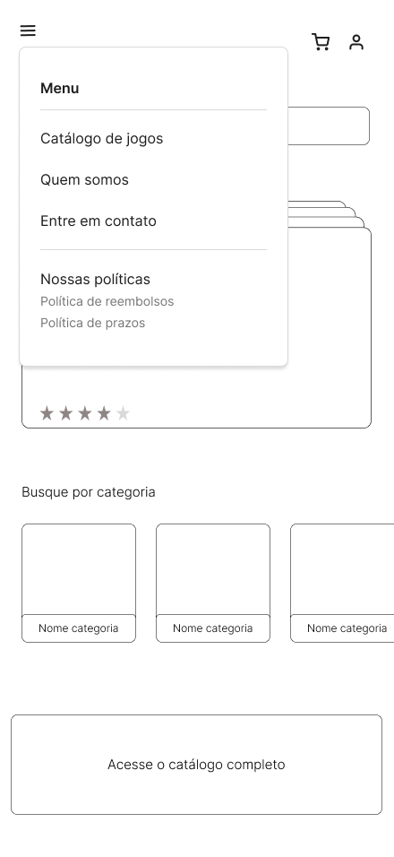
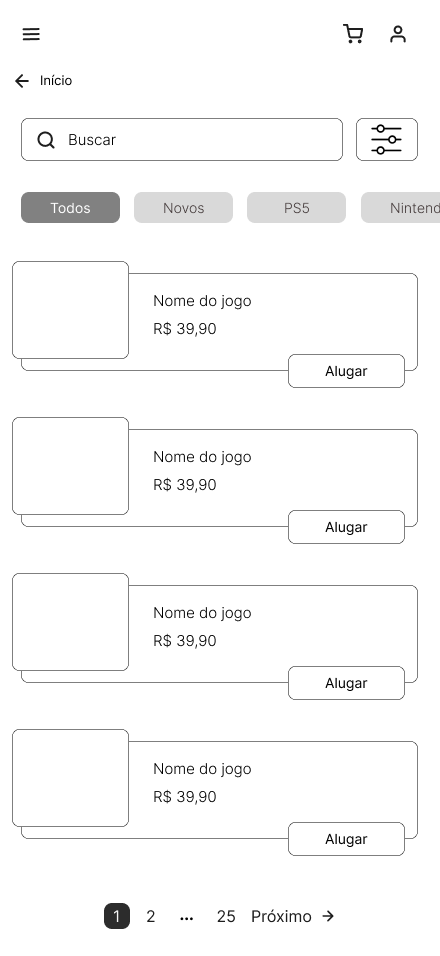
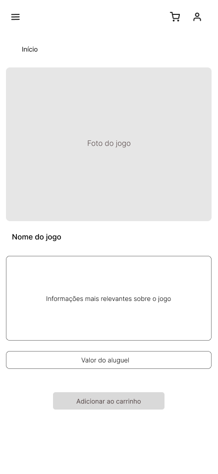
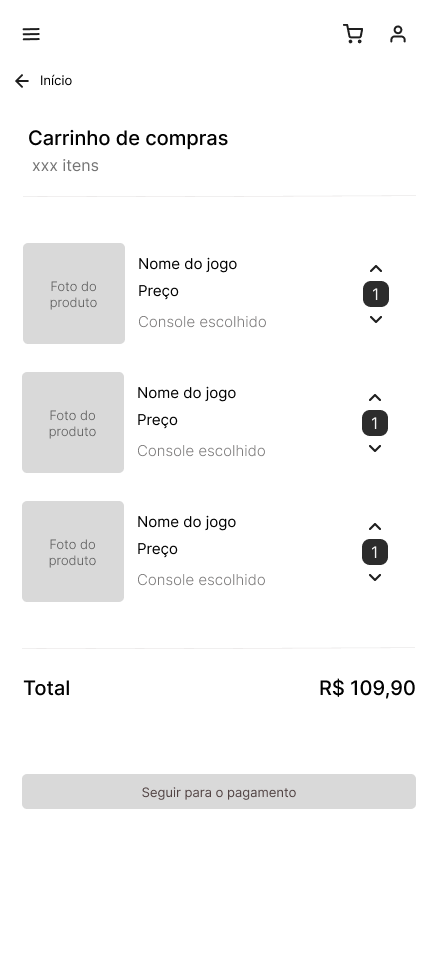
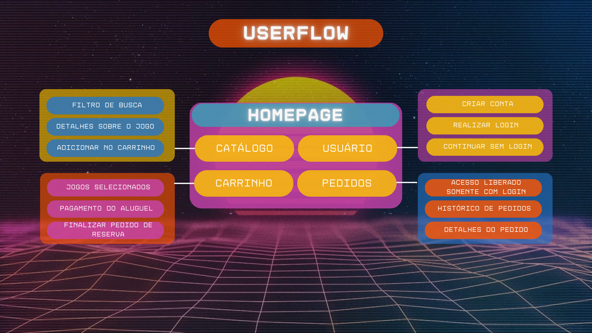

# Front-end Móvel

A NintendIN é uma plataforma de aluguel de jogos e consoles retrô com o objetivo de tornar acessível essa coletânia para os entusiastas da cultura pop e diferentes públicos. Sua plataforma Mobile é voltada para o uso dos consumidores, permitindo o navegamento pela coletânia de jogos disponíveis no catálogo, realização dos aluguéis após a adição no carrinho de compras, criação de login na plataforma e a liberação do acesso do histórico de reservas com o uso do mesmo ativo.
<br>

# Projeto da Interface
[Descreva o projeto da interface móvel da aplicação, incluindo o design visual, layout das páginas, interações do usuário e outros aspectos relevantes.]

## Wireframes
   

   
    

## Design Visual

Buscamos construir uma interface acessível para usuários de todas as idades e níveis de familiaridade com tecnologia, uma vez que o público-alvo da NintendIN é composto por pessoas de diferentes faixas etárias e com variados graus de acesso ao mundo digital. Por isso, optamos por um design minimalista, que facilita a navegação e a compreensão das funcionalidades, mas que ainda assim traz elementos visuais que reforçam a identidade retrô da marca.
A proposta visual combina o novo e o moderno com o antigo e o afetivo. Nosso objetivo foi oferecer uma experiência que despertasse a nostalgia dos usuários em relação aos jogos da infância, ao mesmo tempo em que apresentamos novidades com títulos de consoles mais atuais. Essa fusão entre passado e presente cria uma conexão emocional com o público e reforça o propósito da plataforma.
A paleta de cores da aplicação é concentrada principalmente em tons de roxo, branco e cinza, escolhidos para transmitir modernidade e harmonia visual, além de proporcionar boa legibilidade. Os ícones utilizados são majoritariamente vazados, justamente para evitar poluição visual e manter a interface limpa. Uma exceção intencional é o ícone do controle de videogame, que aparece colorido, preenchido ou como ilustração em diversas áreas da aplicação, garantindo destaque ao símbolo mais icônico do imaginário coletivo relacionado ao universo dos games.
A tipografia adotada é básica e de traços arredondados, escolhida para não roubar a atenção dos elementos principais — os jogos e os consoles. Essa decisão é essencial, considerando que a plataforma exibe diversas informações e fotografias dos produtos disponíveis no catálogo.
De forma geral, o estilo visual da NintendIN foi cuidadosamente planejado para equilibrar estética e funcionalidade, reforçando a proposta da marca e oferecendo uma experiência agradável e intuitiva ao usuário.


# Fluxo de Dados


<br>

# Tecnologias Utilizadas

## 📱 Projeto com React Native + Expo

| **Atuação**              | **Linguagem / Biblioteca**                                     | **Descrição** |
|--------------------------|---------------------------------------------------------------|----------------|
| **Front-End**            | `React Native` <br><br> `JavaScript / TypeScript` <br><br> `expo-router` | Framework para desenvolvimento de apps móveis nativos. <br><br> Linguagens principais do projeto. <br><br> Gerenciamento de rotas com abordagem baseada em arquivos, semelhante ao Next.js. |
| **Estilização e UI**     | `@expo/vector-icons`                                          | Biblioteca de ícones padrão em apps Expo. |
| **APIs e Utilitários**   | `Axios`                                                       | Requisições HTTP de forma simples e eficiente. |
| **Back-End**             | `Node.js + Express` <br><br> `PostgreSQL`                     | API backend em Node. <br><br> Banco de dados relacional. |

## 🛠️ Ferramentas de Desenvolvimento

| **Atuação**              | **Ferramenta**                         | **Descrição** |
|--------------------------|----------------------------------------|----------------|
| **IDE**                  | `Visual Studio Code (VSCode)`          | IDE principal do projeto. |
| **Gerenciador de Pacotes** | `Yarn`, `Npm`                        | Instalação e gerenciamento de dependências. |


# Considerações de Segurança

[Discuta as considerações de segurança relevantes para a aplicação distribuída, como autenticação, autorização, proteção contra ataques, etc.]

# Implantação

[Instruções para implantar a aplicação distribuída em um ambiente de produção.]

1. Defina os requisitos de hardware e software necessários para implantar a aplicação em um ambiente de produção.
2. Escolha uma plataforma de hospedagem adequada, como um provedor de nuvem ou um servidor dedicado.
3. Configure o ambiente de implantação, incluindo a instalação de dependências e configuração de variáveis de ambiente.
4. Faça o deploy da aplicação no ambiente escolhido, seguindo as instruções específicas da plataforma de hospedagem.
5. Realize testes para garantir que a aplicação esteja funcionando corretamente no ambiente de produção.

# Testes

Para a realização dos testes, foram escritos os casos no formato BDD (Behavior Driven Development), usando a estrutura Gherkin, dessa forma mantendo-os de forma clara e objetiva.

Junto a cada um dos casos, temos links com os vídeos da realização destes cenários. Desta forma um mesmo vídeo pode ou não conter mais de um caso de teste.

- Cenário 1: [Cadastro de novos usuários](https://drive.google.com/file/d/1VuhCr85glykuOFpZiCuLnSa6KdoloK--/view?usp=share_link)

```
    Dado que o usuário está na tela inicial do aplicativo
    Quando o usuário clicar no ícone de perfil no topo da tela
    E o usuário clicar no botão "Cadastrar-se"
    E o usuário preencher o formulário de cadastro com dados válidos
    E o usuário clicar no botão "Cadastrar"
    Então o aplicativo deve criar a conta do usuário com sucesso
    E o usuário deve ser redirecionado para a área logada do aplicativo
```

- Cenário 2: [Login de usuários existentes](https://drive.google.com/file/d/1llyVvGyHG5CiiPvRVDs2iTqpOnFuZ3S2/view?usp=share_link)

```
    Dado que o usuário está na tela inicial do aplicativo
    Quando o usuário clicar no ícone de perfil no topo da tela
    E o usuário clicar no botão "Fazer Login"
    E o usuário preencher o campo de email com um endereço válido
    E o usuário preencher o campo de senha com a senha correta
    E o usuário clicar no botão "Entrar"
    Então o aplicativo deve validar as credenciais do usuário
    E o usuário deve ser redirecionado para a área logada do aplicativo
```

- Cenário 3: [Visualização de jogos e filtro por console](https://drive.google.com/file/d/1ydsvRm7PmMoGk1T7xA4ahT-JjwqjAhkz/view?usp=share_link)

```
    Dado que o usuário está na tela inicial com a lista de jogos carregada
    Quando o usuário clicar em um jogo da lista
    Então o aplicativo deve exibir a tela de detalhes do jogo selecionado

    Quando o usuário retornar para a lista de jogos
    E o usuário clicar no filtro de consoles
    E o usuário selecionar um console específico
    Então o aplicativo deve exibir apenas os jogos disponíveis para o console selecionado
```

- Cenário 4: [Adicionar item ao carrinho via modal de detalhes](https://drive.google.com/file/d/1HTgZB6y6SQNM67T4HJu7KH7XkiGBtEkv/view?usp=share_link)

```
    Dado que o usuário está na tela inicial com a lista de produtos visível
    Quando o usuário abrir a modal de detalhes de um produto
    E o usuário clicar no botão "Adicionar ao carrinho"
    Então o item deve ser adicionado ao carrinho com sucesso
```

- Cenário 5: [Adicionar itens ao carrinho](https://drive.google.com/file/d/1HTgZB6y6SQNM67T4HJu7KH7XkiGBtEkv/view?usp=share_link)

```
    Dado que o usuário está na tela inicial do aplicativo
    Quando o usuário clicar no ícone de perfil no topo da tela
    E o usuário clicar no botão "Cadastrar-se"
    E o usuário preencher o formulário de cadastro com dados válidos
    E o usuário clicar no botão "Cadastrar"
    Então o aplicativo deve criar a conta do usuário com sucesso
    E o usuário deve ser redirecionado para a área logada do aplicativo
```

- Cenário 6: [Visualizar os itens no carrinho](https://drive.google.com/file/d/1HTgZB6y6SQNM67T4HJu7KH7XkiGBtEkv/view?usp=share_link)

```
    Dado que o usuário adicionou pelo menos um item ao carrinho
    Quando o usuário abrir o carrinho de compras
    Então o aplicativo deve exibir a lista de itens que foram adicionados ao carrinho
```

- Cenário 7: [Finalizar compra e visualizar pedido nos Meus Pedidos](https://drive.google.com/file/d/1HTgZB6y6SQNM67T4HJu7KH7XkiGBtEkv/view?usp=share_link)

```
    Dado que o usuário tem pelo menos um item no carrinho
    Quando o usuário clicar no botão "Finalizar compra"
    Então o aplicativo deve redirecionar o usuário para a tela de checkout

    Quando o usuário preencher os dados de pagamento com informações válidas
    E o usuário clicar no botão "Pagar"
    Então o pedido deve ser processado com sucesso

    Quando o usuário acessar a aba "Meus Pedidos" através do ícone no topo da tela
    Então o aplicativo deve exibir o pedido recém-criado na lista de pedidos do usuário
```

- Cenário 8: [Remover itens do carrinho](https://drive.google.com/file/d/1teKyBdXNgKCAO1oza3kSPlkzX8RFRIbg/view?usp=share_link)

```
    Dado que o usuário possui pelo menos um item no carrinho
    Quando o usuário abrir o carrinho de compras
    E o usuário clicar no ícone de lixeira ao lado de um dos itens
    Então o aplicativo deve remover apenas o item selecionado do carrinho
    E o carrinho deve ser atualizado exibindo os itens restantes
```

- Cenário 9: [Remover todos os itens do carrinho pela lixeira geral](https://drive.google.com/file/d/1teKyBdXNgKCAO1oza3kSPlkzX8RFRIbg/view?usp=share_link)

```
    Dado que o usuário possui dois ou mais itens no carrinho
    Quando o usuário abrir o carrinho de compras
    E o usuário clicar no ícone de lixeira no canto superior da tela
    Então o aplicativo deve remover todos os itens do carrinho
    E o carrinho deve ser exibido vazio
```

- Cenário 10: [Logout](https://drive.google.com/file/d/1W8CQeoPU0KDFQXv_Tp9_yV9HulVhVwAi/view?usp=share_link)

```
    Dado que o usuário está logado no aplicativo
    Quando o usuário clicar no ícone de perfil no topo da tela
    E o usuário clicar no botão "Sair"
    Então o aplicativo deve encerrar a sessão do usuário
    E o usuário deve ser redirecionado para a tela de login
```
<br>

# Referências

* Criação de Wireframes: https://www.figma.com/
* Criação do Fluxo de Dados:  https://www.canva.com/
