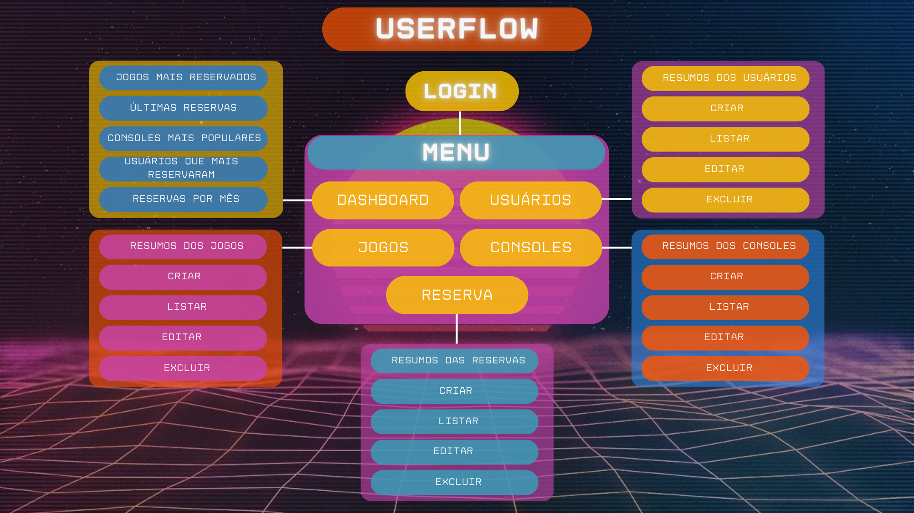

# Front-end Web
A NintendIN é uma plataforma de aluguel de jogos e consoles retrô com o objetivo de tornar acessível essa coletânia para os entusiastas da cultura pop e diferentes públicos. Sua plataforma Front-End é voltada para o uso administrativo da empresa, permitindo o gerenciamento dos aluguéis realizados pelos clientes, jogos e consoles em estoque e o acompanhamento das métricas da plataforma.

 

# Projeto da Interface Web
A aplicação apresenta uma interface moderna, funcional e intuitiva, com foco na usabilidade e na organização das informações para uma experiência agradável ao usuário. As cores utilizadas seguem com predominância dos tons amarelo, rosa, roxo e laranja para o login e os tons branco e roxo para as telas de visualização, contrastando com elementos em cores vibrantes para destacar ações e informações importantes.

1. Tela de Login
Design Visual: Interface simples e direta, com fundo colorido e campos destacados em branco para entrada de dados.

Layout: Centralizado com campos para usuário e senha, botão de login e logo no topo.

Interações:

Validação de campos obrigatórios (e-mail e senha).

Redirecionamento para o dashboard após login bem-sucedido.

Usabilidade: Foco total na ação de login, sem elementos distrativos.

2. Dashboard (Painel Principal)
Design Visual: A interface do dashboard é moderna e intuitiva, com cards coloridos e ícones bem definidos, proporcionando uma navegação rápida e agradável. As cores seguem o padrão visual da aplicação — com fundo branco, e elementos visuais em tons que destacam a hierarquia da informação. Ícones minimalistas ajudam na identificação rápida das seções.

Layout: Barra lateral fixa à esquerda, com ícones verticais para acesso rápido às seções principais: Jogos, Reservas, Usuários e Consoles. Ícones possuem destaque visual ao serem selecionados (fundo com leve sombra e mudança de cor).

Área principal dividida em cards grandes e interativos, centralizados ou em grade, representando cada seção.

Cada card exibe:

Ícone ilustrativo.

Nome da seção.

Um contador ou resumo (ex: “15 jogos cadastrados”).

Efeito de realce ao passar o cursor (hover).

Interações:

Cada card exibe um contador.

Itens da barra lateral redirecionam para uma tela específica.

Feedback visual claro ao interagir com qualquer item (ex: animação suave, sombra ao clicar).

Usabilidade: A estrutura é planejada para proporcionar acesso rápido, informações visuais resumidas e experiência agradável.

3. Tela de Usuário
Design Visual: Estrutura em tabela com cabeçalho destacado e fundo claro, contendo também cards com resumo de usuários cadastrados e usuários com mais reservas.

Layout: Tabela centralizada listando usuários com colunas como nome, e-mail e ações (editar/excluir).

Interações:

Botão de “Adicionar novo usuário”.

Ações de editar e excluir ao lado de cada registro.

Usabilidade: Fácil gerenciamento de usuários com ações claras e diretas.

4. Tela de Jogos
Design Visual: Estrutura em tabela, contendo a lista exibindo os jogos cadastrados, contendo também cards com resumo dos jogos, com contador de total de jogos e jogos mais alugados.

Layout: Tabela centralizada listando jogos com colunas como nome, console, preço, descrição e com botão de ação (editar/excluir).

Interações:

Inclusão de novo jogo.

Visualização e edição rápida de dados.

Usabilidade: Interface visualmente atrativa com foco na identificação rápida dos jogos.

5. Tela de Consoles
Design Visual: Estrutura em tabela, utilizando lista e cards com resumo do total de consoles e console com mais jogos.

Layout: Tabela centralizada listando consoles com colunas como nome e quantidade de jogos, e com botão de ação (editar/excluir).

Interações:

Cadastro, edição e exclusão de consoles.

Usabilidade: Organização clara para manter o controle dos dispositivos disponíveis.

6. Tela de Reservas
Design Visual: Estrutura em tabela, utilizando lista e cards com resumo do total de reservas, reservas pendentes e reservas atrasadas.

Layout: Apresenta uma tabela de reservas com colunas como usuário, jogo, status, data e horário da reserva, data e horário da aprovação, data e horário da devolução. Estrutura de tabela bem definida com botões de ação (editar/excluir).

Interações:

Criação de nova reserva.

Edição/cancelamento de reservas existentes.

Usabilidade: Permite gestão eficiente das reservas com clareza das informações.

### Wireframes

[Inclua os wireframes das páginas principais da interface, mostrando a disposição dos elementos na página.]

### Design Visual

[Descreva o estilo visual da interface, incluindo paleta de cores, tipografia, ícones e outros elementos gráficos.]

# Fluxo de Dados

 

## Tecnologias Utilizadas

Essas são as tecnologias utilizadas para o desenvolvimento de nosso sistema de aluguel de jogos, **Nintendin**:  

| Atuação | Linguagem / Biblioteca | Descrição |                                  
|---------|------------------------|-----------|
| **Front-End**  | **`React`**    **`JavaScript`**    **`React Router DOM`** | Para a aplicação web, garantindo uma experiência interativa e responsiva.    Como linguagem principal para o frontend.    Para gerenciamento de rotas SPA (Single Page Application). | 
| **Estilização e UI** | **`Mantine`**    **`@tabler/icons-react`** | Biblioteca de componentes e hooks para criação de UI moderna e acessível.    Ícones SVG integrados à interface com Mantine. |
| **APIs e Utilitários**  | **`Axios`**    **`Moment.js`** | Biblioteca para realizar requisições HTTP de maneira simplificada, permitindo chamadas à API do backend.    Para manipulação e formatação de datas. | 
| **Gráficos e Visualização** | **`Recharts`** | Biblioteca de gráficos baseada em componentes React para visualização de dados. |
| **Testes** | **`Testing Library (React, DOM, User Event, Jest DOM)`** | Conjunto de ferramentas para testes unitários e de comportamento em componentes React. |
| **Back-End**  | **`Node.js + Express`**    **`PostgreSQL`** | Para o desenvolvimento da API backend.    Utilizado como banco de dados relacional. |
| **Roteamento e Monitoramento** | **`Web Vitals`** | Para medir e reportar métricas de performance da aplicação. |

| Atuação | Ferramenta de Desenvolvimento | Descrição |                                  
|---------|-------------------------------|-----------|
| **IDE** | **`Visual Studio Code (VSCode)`** | Principal IDE utilizada no desenvolvimento, devido à sua versatilidade e ampla compatibilidade com extensões. |
| **Gerenciador de Pacotes** | **`Yarn`** | Utilizado para instalar e gerenciar dependências do projeto de forma rápida e eficiente. |

 

# Considerações de Segurança

Autenticação: é usado JWT para autenticação das requisições. Apenas após se autenticar o usuário conseguirá usar as aplicação. O token fica salvo no localStorage.

Autorização: apenas usuários com o cargo de administrador conseguem acessar essa aplicação. Os demais usuários de cargo comum, não conseguem acessar a aplicação.

É utilizado CORS para que apenas essa aplicação web se comunique com o servidor backend.

# Implantação

O sistema está hospedado na Vercel. A Vercel fornece ferramentas de desenvolvedor e infraestrutura de nuvem para criar, dimensionar e proteger uma web mais rápida e personalizada. Toda a infraestrutura é abstraída e nos é servida um domínio gratuito .vercel.app, basta escolher o repositório e fazer certas configurações. A hospedagem é linkada ao repositório e o deploy é feito automaticamente a cada mudança na branch main.

https://nintendin.vercel.app/login

# Testes

[Descreva a estratégia de teste, incluindo os tipos de teste a serem realizados (unitários, integração, carga, etc.) e as ferramentas a serem utilizadas.]

1. Crie casos de teste para cobrir todos os requisitos funcionais e não funcionais da aplicação.
2. Implemente testes unitários para testar unidades individuais de código, como funções e classes.
3. Realize testes de integração para verificar a interação correta entre os componentes da aplicação.
4. Execute testes de carga para avaliar o desempenho da aplicação sob carga significativa.
5. Utilize ferramentas de teste adequadas, como frameworks de teste e ferramentas de automação de teste, para agilizar o processo de teste.

# Referências

* Criação de Wireframes: https://www.figma.com/
* Criação do Fluxo de Dados:  https://www.canva.com/
