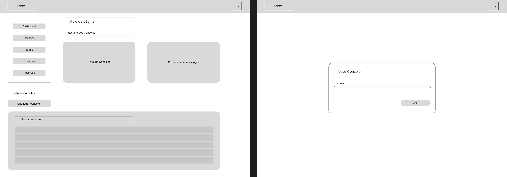

# Front-end Web
A NintendIN é uma plataforma de aluguel de jogos e consoles retrô com o objetivo de tornar acessível essa coletânia para os entusiastas da cultura pop e diferentes públicos. Sua plataforma Front-End é voltada para o uso administrativo da empresa, permitindo o gerenciamento dos aluguéis realizados pelos clientes, jogos e consoles em estoque e o acompanhamento das métricas da plataforma.

 

# Projeto da Interface Web
A aplicação apresenta uma interface moderna, funcional e intuitiva, com foco na usabilidade e na organização das informações para uma experiência agradável ao usuário. As cores utilizadas seguem com predominância dos tons amarelo, rosa, roxo e laranja para o login e os tons branco e roxo para as telas de visualização, contrastando com elementos em cores vibrantes para destacar ações e informações importantes.

## 🔐 Tela de Login

### Design Visual
Interface simples e direta, com fundo colorido e campos destacados em branco para entrada de dados.

### Layout
- Centralizado com campos para usuário e senha.
- Botão de login.
- Logo no topo.

### Interações
- Validação de campos obrigatórios (e-mail e senha).
- Redirecionamento para o dashboard após login bem-sucedido.

### Usabilidade
Foco total na ação de login, sem elementos distrativos.

---

## 🧭 Dashboard (Painel Principal)

### Design Visual
A interface do dashboard é moderna e intuitiva, com cards coloridos e ícones bem definidos, proporcionando uma navegação rápida e agradável. As cores seguem o padrão visual da aplicação — com fundo branco, e elementos visuais em tons que destacam a hierarquia da informação. Ícones minimalistas ajudam na identificação rápida das seções.

### Layout
- Barra lateral fixa à esquerda, com ícones verticais para acesso rápido às seções principais: Jogos, Reservas, Usuários e Consoles.
- Ícones possuem destaque visual ao serem selecionados (fundo com leve sombra e mudança de cor).
- Área principal dividida em cards grandes e interativos, centralizados ou em grade, representando cada seção.

#### Cada card exibe:
- Ícone ilustrativo.
- Nome da seção.
- Um contador ou resumo (ex: “15 jogos cadastrados”).
- Efeito de realce ao passar o cursor (hover).

### Interações
- Cada card exibe um contador.
- Itens da barra lateral redirecionam para uma tela específica.
- Feedback visual claro ao interagir com qualquer item (ex: animação suave, sombra ao clicar).

### Usabilidade
A estrutura é planejada para proporcionar acesso rápido, informações visuais resumidas e experiência agradável.

---

## 👤 Tela de Usuário

### Design Visual
Estrutura em tabela com cabeçalho destacado e fundo claro, contendo também cards com resumo de usuários cadastrados e usuários com mais reservas.

### Layout
- Tabela centralizada listando usuários com colunas como nome, e-mail e ações (editar/excluir).

### Interações
- Botão de “Adicionar novo usuário”.
- Ações de editar e excluir ao lado de cada registro.

### Usabilidade
Fácil gerenciamento de usuários com ações claras e diretas.

---

## 🎮 Tela de Jogos

### Design Visual
Estrutura em tabela, contendo a lista exibindo os jogos cadastrados, contendo também cards com resumo dos jogos, com contador de total de jogos e jogos mais alugados.

### Layout
- Tabela centralizada listando jogos com colunas como nome, console, preço, descrição e com botão de ação (editar/excluir).

### Interações
- Inclusão de novo jogo.
- Visualização e edição rápida de dados.

### Usabilidade
Interface visualmente atrativa com foco na identificação rápida dos jogos.

---

## 🕹️ Tela de Consoles

### Design Visual
Estrutura em tabela, utilizando lista e cards com resumo do total de consoles e console com mais jogos.

### Layout
- Tabela centralizada listando consoles com colunas como nome e quantidade de jogos, e com botão de ação (editar/excluir).

### Interações
- Cadastro, edição e exclusão de consoles.

### Usabilidade
Organização clara para manter o controle dos dispositivos disponíveis.

---

## 📅 Tela de Reservas

### Design Visual
Estrutura em tabela, utilizando lista e cards com resumo do total de reservas, reservas pendentes e reservas atrasadas.

### Layout
- Apresenta uma tabela de reservas com colunas como usuário, jogo, status, data e horário da reserva, data e horário da aprovação, data e horário da devolução.
- Estrutura de tabela bem definida com botões de ação (editar/excluir).

### Interações
- Criação de nova reserva.
- Edição/cancelamento de reservas existentes.

### Usabilidade
Permite gestão eficiente das reservas com clareza das informações.
### Wireframes

## 1. Tela de Login

## 2. Tela de Dashboard

## 3. Tela de Usuários

## 4. Tela de Reservas

## 5. Tela de Jogos

## 6. Tela de Consoles

## Design Visual

O design visual da interface é moderno, vibrante e acessível. A seguir estão os principais elementos que compõem o estilo do sistema:

### 🎨 Paleta de Cores

A identidade visual é baseada principalmente em tons de **roxo (purple)** como cor primária e **laranja (orange)** como cor de destaque.

#### Roxo (Purple)
- `#f3e8ff`
- `#e9d5ff`
- `#d8b4fe`
- `#c084fc`
- `#a855f7` ← cor primária
- `#9333ea`
- `#7e22ce`
- `#6b21a8`
- `#581c87`
- `#3b0764`

#### Laranja (Orange)
- `#fff7ed`
- `#ffedd5`
- `#fed7aa`
- `#fdba74`
- `#fb923c`
- `#f97316`
- `#ea580c`
- `#c2410c`
- `#9a3412`
- `#7c2d12`
- #### Branco (White)
- `#ffffff`
  
### 🔤 Tipografia

- **Fonte principal:** `Poppins, sans-serif`

### 🧩 Ícones

- Utilizamos a biblioteca **[@tabler/icons-react](https://tabler.io/icons)** para ícones vetoriais com estilo clean e alinhados à linguagem visual moderna.
- Os ícones são aplicados com consistência em botões, navegação e componentes de feedback.

### 🧱 Elementos Gráficos

- **Botões:** Cores sólidas com cantos levemente arredondados, sombras sutis e animações suaves de hover.
- **Cards:** Layouts com bordas arredondadas e sombreamento leve para destacar blocos de conteúdo.
- **Inputs e Selects:** Estilo minimalista.
- **Responsividade:** O layout é flexível e adaptável.

---

# Fluxo de Dados

 

## Tecnologias Utilizadas

Essas são as tecnologias utilizadas para o desenvolvimento de nosso sistema de aluguel de jogos, **Nintendin**:  

| Atuação | Linguagem / Biblioteca | Descrição |                                  
|---------|------------------------|-----------|
| **Front-End**  | **`React`**    **`JavaScript`**    **`React Router DOM`** | Para a aplicação web, garantindo uma experiência interativa e responsiva.    Como linguagem principal para o frontend.    Para gerenciamento de rotas SPA (Single Page Application). | 
| **Estilização e UI** | **`Mantine`**    **`@tabler/icons-react`** | Biblioteca de componentes e hooks para criação de UI moderna e acessível.    Ícones SVG integrados à interface com Mantine. |
| **APIs e Utilitários**  | **`Axios`**    **`Moment.js`** | Biblioteca para realizar requisições HTTP de maneira simplificada, permitindo chamadas à API do backend.    Para manipulação e formatação de datas. | 
| **Gráficos e Visualização** | **`Recharts`** | Biblioteca de gráficos baseada em componentes React para visualização de dados. |
| **Testes** | **`Testing Library (React, DOM, User Event, Jest DOM)`** | Conjunto de ferramentas para testes unitários e de comportamento em componentes React. |
| **Back-End**  | **`Node.js + Express`**    **`PostgreSQL`** | Para o desenvolvimento da API backend.    Utilizado como banco de dados relacional. |
| **Roteamento e Monitoramento** | **`Web Vitals`** | Para medir e reportar métricas de performance da aplicação. |

| Atuação | Ferramenta de Desenvolvimento | Descrição |                                  
|---------|-------------------------------|-----------|
| **IDE** | **`Visual Studio Code (VSCode)`** | Principal IDE utilizada no desenvolvimento, devido à sua versatilidade e ampla compatibilidade com extensões. |
| **Gerenciador de Pacotes** | **`Yarn`** | Utilizado para instalar e gerenciar dependências do projeto de forma rápida e eficiente. |

 

# Considerações de Segurança

Autenticação: é usado JWT para autenticação das requisições. Apenas após se autenticar o usuário conseguirá usar as aplicação. O token fica salvo no localStorage.

Autorização: apenas usuários com o cargo de administrador conseguem acessar essa aplicação. Os demais usuários de cargo comum, não conseguem acessar a aplicação.

É utilizado CORS para que apenas essa aplicação web se comunique com o servidor backend.

# Implantação

O sistema está hospedado na Vercel. A Vercel fornece ferramentas de desenvolvedor e infraestrutura de nuvem para criar, dimensionar e proteger uma web mais rápida e personalizada. Toda a infraestrutura é abstraída e nos é servida um domínio gratuito .vercel.app, basta escolher o repositório e fazer certas configurações. A hospedagem é linkada ao repositório e o deploy é feito automaticamente a cada mudança na branch main.

https://nintendin.vercel.app/login

# Testes

[Descreva a estratégia de teste, incluindo os tipos de teste a serem realizados (unitários, integração, carga, etc.) e as ferramentas a serem utilizadas.]

1. [Login](./videos/Login/2025-05-10%2019-25-28.mkv) - O usuário deve entrar  com e-mail e senha.

2. [Consoles Criar  Editar  Visualizar  Deletar](./videos/Consoles/2025-05-10%2019-38-54.mkv) - É possivel criar, editar, visualizar e deletar os consoles.

3. [Jogos Criar  Editar  Visualizar  Deletar](./videos/Jogos/2025-05-10%2019-41-03.mkv) - É possível criar, editar, visualizar e deletar jogos. 

4. [Reservas Criar  Editar  Visualizar  Deletar](./videos/Reservas/2025-05-12%2000-52-56.mkv) - É possível criar, editar, visualizar e deletar uma reserva.

5. [Usuário Criar  Editar  Visualizar  Deletar](./videos/Usuário/2025-05-10%2019-29-00.mkv) - Para cirar, basta inserir os dados do usário no formulário, é possivel também edidar o cadastro, visualizar e deletar caso necessário.

6. [Testar ordenacao de paginas](./videos/Ordenacao/2025-05-12%2000-44-00.mkv) - A ordenação é feita de acordo com a necessidade do usuário, basta clicar na coluna que deseja ordenar.

7. [Testas as buscas de páginas](./videos/Buscas/2025-05-12%2000-47-36.mkv) - Para fazer a busca, basta digitar a informação.

7. [Testar o Logout](./videos/Logout/2025-05-12%2000-57-17.mkv) - Clicar em sair para fazer o logout.

# Referências

* Criação de Wireframes: https://www.figma.com/
* Criação do Fluxo de Dados:  https://www.canva.com/
